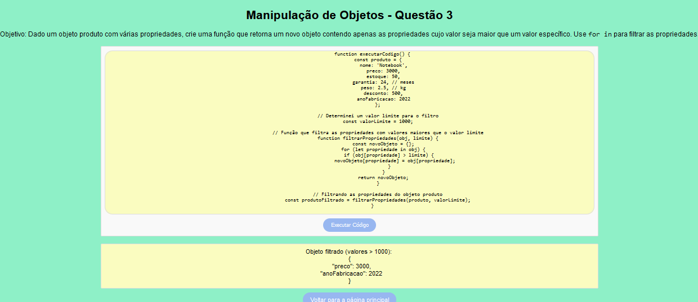

# Ativ2_JS

Bem-vindo ao **Ativ2_JS**! Este é um projeto simples em Node.js com Express para exibir questões. A ideia é que você possa selecionar uma questão na página inicial e visualizar o conteúdo correspondente em páginas diferentes.


### Descrição das Pastas e Arquivos

- **app.js**: O cérebro do projeto. Ele inicializa o servidor Express, configura rotas e middlewares. É o ponto de partida da nossa aplicação.

- **package.json**: O arquivo de configuração do Node.js. Aqui ficam listadas as dependências do projeto, como o Express.

- **public/**: Pasta para arquivos estáticos, como CSS e JavaScript, que são servidos diretamente pelo Express.
  - **css/styles.css**: O arquivo CSS que dá o estilo para a nossa aplicação.
  - **js/script.js**: O JavaScript que faz algumas funcionalidades extras no lado do cliente.

- **routes/**: Contém as definições de rotas da aplicação.
  - **questoes2.js**: Define as URLs relacionadas às questões e como elas são tratadas.

- **views/**: Onde moram os arquivos HTML. Cada questão tem seu próprio arquivo HTML aqui.
  - **index.html**: Página inicial com os botões para selecionar uma questão.
  - **questao1.html** e **questao2.html**: Exemplos de páginas para as questões.

- **controllers/**: Contém a lógica para processar as requisições e responder com as páginas corretas.
  - **questoesController.js**: Lida com a exibição das páginas de questões com base na URL.

## Passo a Passo para Rodar o Projeto

### 1. Criação do package.json

Navegue até a pasta `Ativ2_JS` e inicie um projeto Node.js:

```bash
npm init -y
```

Isso cria o arquivo package.json: Arquivo de configuração do projeto Node.js que lista as dependências (Express, por exemplo). Agora, instale o Express:

```bash
npm install express
```

Após isso, criamos no diretório raiz do projeto:

1 - Arquivo app.js:
O arquivo principal que inicializa o servidor Express e configura as rotas e middlewares.

2 - A pasta routes/ e o arquivo questoes2.js.

3 - A pasta controllers/ e o arquivo questoesController.js.

4 - A pasta views/ e adicione os arquivos HTML.

5 - A pasta public/: Pasta para arquivos estáticos (CSS, JS). 

    5a - A pasta public/css/ e o arquivo styles.css, o arquivo de estilização.

    5b - A pasta public/js/ e o arquivo script.js, que é para:
Capturar o clique no botão "Ver Questão".
Verificar qual botão de rádio foi selecionado.
Redirecionar para a URL correta se uma questão foi selecionada. Caso contrário, exibe um alerta.

6 - A pasta Imgs ao mesmo nível das pastas public, views, e controllers, para mostrar imagens relacionadas ao projeto.

URL de visualização do conteúdo: http://localhost:3000/atividades2/

-------------------------------------------------------------------------------------------------
**A Estrutura que você pode seguir**:


Ativ2_JS/

│

├── app.js

├── package.json

├── Imgs

├── public/

│   ├── css/

│   │   └── styles.css

│   └── js/

│       └── script.js

│

├── routes/

│   └── questoes2.js

│

├── views/

│   ├── index.html

│   ├── questao1.html

|   ├── ...

│   └── questao15.html

│

└── controllers/

    └── questoesController.js

-------------------------------------------------------------------------------------------------

## Imagens





